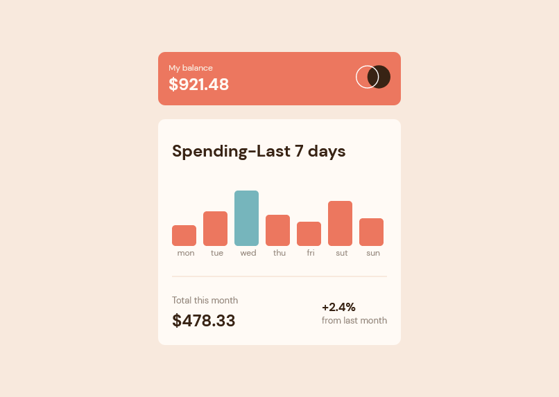

# Frontend Mentor - Expenses chart component solution

## Screenshot

## Links

- Solution URL: [Add solution URL here](https://www.frontendmentor.io/solutions/expenses-chart-component-TKsLR1Cncv)
- Live Site URL: [Add live site URL here](https://chartcomponent100.netlify.app)

## My process

### Built with

- Semantic HTML5 markup
- CSS
- Javascript

## Author

- Facebook - [@Suhaybjirde](https://www.facebook.com/profile.php?id=100087769545110)
- Frontend Mentor - [@Suhaybjirde](https://www.frontendmentor.io/profile/suhaybjirde)
